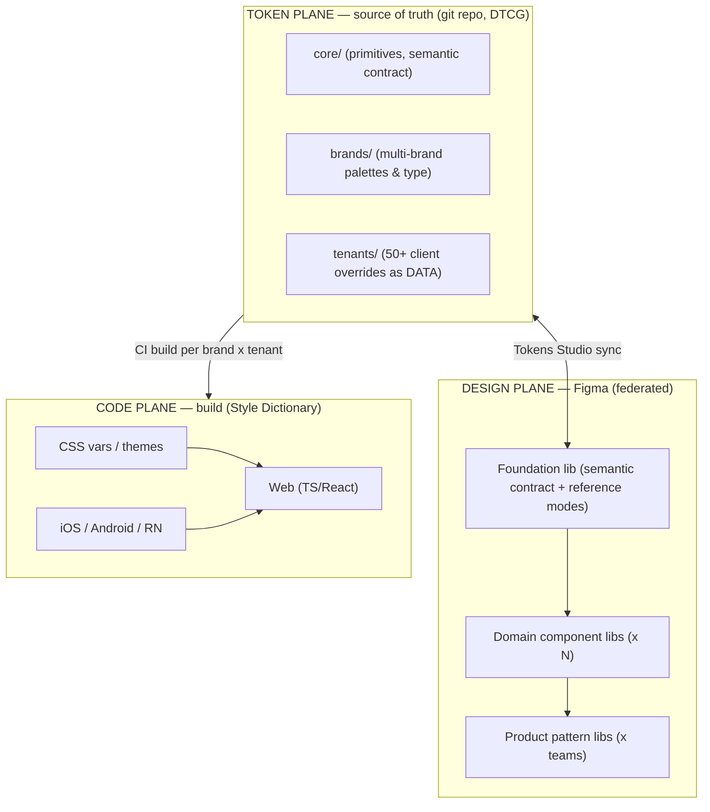
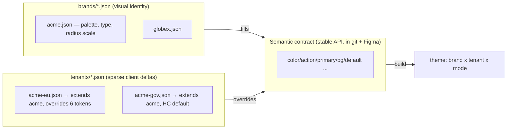
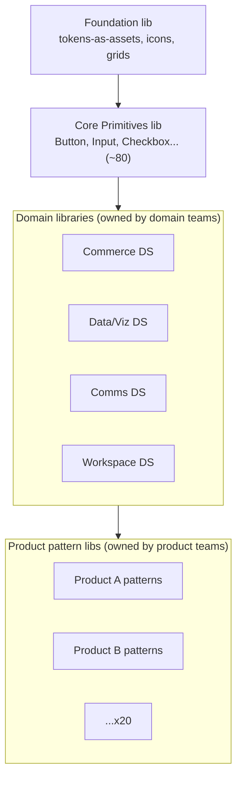
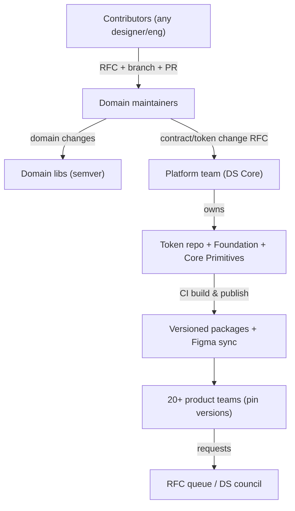
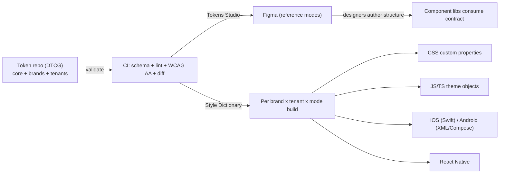

# Architecture Review & Redesign (v2)

> Critique of [`design-system-architecture.md`](./design-system-architecture.md) from the seat of a Fortune 500 design systems lead, followed by a redesign that holds up at **20+ product teams, 1000+ components, 50+ white-label clients, multiple brands, and first-class token export to code**.

The short version: **v1 is a correct *single-team* architecture and a *wrong* enterprise one.** Its fatal assumption is that Figma is the source of truth and that variation (brand, theme, tenant) can be expressed as Figma **modes**. That assumption breaks hard against Figma's mode cap, publish/merge model, and file-performance ceiling. v2 fixes this by demoting Figma from "source of truth" to "one consumer of a token pipeline," and by **federating** both libraries and ownership.

---

## Part 1 — Critique

### 1.1 Scalability risks

| Risk | Why v1 breaks at scale | Severity |
| --- | --- | --- |
| **Mode explosion** | v1 models `Brand`, `Theme`, `Density`, and `Tenant` as collection **modes**. Figma caps modes at **~40 per collection (Enterprise; far fewer on lower tiers)**. 50+ tenants × multiple brands cannot be modes. The `Tenant` collection alone dies at client #41. | 🔴 Critical |
| **Combinatorial theming** | Modes are a *flat list per collection*, not a real matrix. "Brand × Theme × Density × Tenant" is ~50×4×3×N — there is no Figma primitive that expresses this without enumerating combinations. | 🔴 Critical |
| **Monolithic libraries** | Five shared files holding 1000+ components means huge files. Canvas render, asset-panel indexing, and **publish time** degrade non-linearly. Library updates become multi-minute events. | 🔴 Critical |
| **Deep alias chains** | `component → semantic → brand-primitive → raw` across thousands of variables increases resolution cost and fragility; one retargeted semantic var ripples everywhere with no test gate. | 🟠 High |
| **Single-file branching bottleneck** | 20 teams branching shared library files; Figma merges are serialized and conflict-prone. The shared Variables file becomes a global lock. | 🟠 High |

### 1.2 Governance issues

- **Central Core team is a publish gatekeeper for everything.** At 20 teams this is a queue, not a process. Token approval becomes the critical path for every product release.
- **No machine-enforced rules.** "Needs Review" sections and naming conventions are honor-system. At scale, conventions drift the moment they're not linted in CI.
- **Ownership isn't encoded.** One Variables file + a couple component files = no `CODEOWNERS` boundary, no clear "who can merge what," no blast-radius isolation.
- **No real versioning contract.** v1 mentions semver in prose but Figma library publishing has no semantic versions or changelogs natively; consumers can't pin a version or stage upgrades.
- **No contribution tiers.** 20 teams need a federated model (core vs domain maintainers vs contributors), an RFC process, and SLAs — none are defined.

### 1.3 White-label limitations

- **Tenants-as-modes is the core flaw** (see mode cap). 50+ clients cannot live as Figma modes, and even if they could, 50 sparse-override mode columns is unreviewable and unmaintainable.
- **Brand-as-primitive-mode centralizes risk.** Every new brand requires editing the *shared* primitive collection — a global file, a central bottleneck, and impossible to delegate to a client or a solutions team safely.
- **No automated contrast validation across clients.** Manually checking WCAG 2.2 AA for 50 clients × light/dark/HC is infeasible; v1 makes it a manual publish-checklist item.
- **No brand/tenant data separation.** v1 conflates *brand identity* (palette, type) with *tenant configuration* (which features, which density, logo). These have different owners and lifecycles.

### 1.4 Token management problems

- **Figma as source of truth doesn't round-trip.** Generating and maintaining 50+ client themes by hand in Figma, then exporting, has no git history, no diffable review, no rollback, no CI.
- **No validation/versioning tooling.** No diff gates, no schema validation, no automated contrast/duplication/orphan checks, no published package versions.
- **Component-token proliferation.** Without lint, "only when unique" decays into a component token for everything — the exact anti-pattern `token-map.md` warns about, but unenforced.
- **Typography pinned to Text Styles.** Text Styles have weak mode support and don't export cleanly per theme, undercutting the design-to-code contract.

### 1.5 Figma performance concerns

- **Mode cap (~40 Enterprise)** — already covered, but it's also a *performance* wall: more modes = heavier variable resolution per frame.
- **Variable volume.** Thousands of variables with deep alias chains slow selection, hover, and mode switching on large pages.
- **Library swap / reindex cost.** Switching enabled libraries or republishing a monolith forces consumers to re-resolve large dependency graphs.
- **Instance depth.** Composite + product patterns with deeply nested instances and many exposed properties degrade canvas interaction and increase memory.

### 1.6 Migration challenges

- **Big-bang re-binding.** Moving existing product files onto the new token chains is a manual, error-prone, file-by-file effort with no codemod in Figma.
- **Renames are breaking.** Any major token rename detaches bindings in consumer files; v1 has no automated migration path.
- **50-client onboarding has no factory.** Each new client is bespoke manual work.
- **No parallel-run safety.** v1 doesn't define how old and new systems coexist during cutover.

---

## Part 2 — Redesign (v2)

### 2.1 The central shift: three planes, one source of truth

The key move is to stop treating Figma as the system of record. The **source of truth is a git-versioned token repository** (DTCG JSON). Figma and code are both *consumers/producers* that sync against it.

| Plane | System of record for | Tooling | Owns scale axis |
| --- | --- | --- | --- |
| **Token plane** | All *values* + 50+ tenants + brands | Git + DTCG + Tokens Studio + CI | Clients/brands (data, not modes) |
| **Design plane** | *Structure*: semantic contract, components, patterns | Figma federated libraries | Components (federation) |
| **Code plane** | Platform artifacts | Style Dictionary | Platforms/products |

This single decision resolves the mode cap, the round-trip problem, validation, versioning, and client onboarding — because **tenants become data rows in git, not Figma modes.**

### 2.2 Figma mode budget (designed, not accidental)

Figma stays well under the ~40-mode cap by holding only a **fixed, small** set of axes. Everything else is generated in the code plane.

| Collection | Modes (fixed) | Count | Notes |
| --- | --- | --- | --- |
| `Theme` | Light · Dark · Light-HC · Dark-HC | 4 | A11y high-contrast included |
| `Density` | Comfortable · Compact · Touch | 3 | Responsive web/mobile |
| `Brand` (reference only) | Default + up to ~8 flagship brands | ≤ ~10 | **Only brands designers actively design against**; the other 40+ live in git, generated to code |
| `Primitives` | (single mode) | 1 | Raw scales |
| `Components` | (alias only, no modes) | — | Inherit semantic |

> Rule: **Figma never holds a mode per tenant.** Designers verify against a representative subset of brands; the full 50+ client matrix is produced and contrast-validated by CI, not eyeballed in Figma.

### 2.3 White-label at scale: brand vs tenant as data

Separate the two concepts that v1 conflated:

- **Brand** = visual identity (palette, type, radius personality). ~handful to dozens. Maps to the semantic contract.
- **Tenant** = a client deployment that *extends a brand* and overrides a **sparse** set of semantic tokens (often <10). 50+ of these, each a small reviewable JSON file with `$extends`.
- **Inheritance resolved at build time** (not in Figma): `semantic default → brand → tenant → mode`. Output = one theme bundle per `brand × tenant × mode`, generated by CI.
- **Self-service onboarding:** a new client = a new `tenants/<id>.json` PR. CI validates schema + WCAG 2.2 AA contrast for every mode and fails the PR if any pair drops below threshold. This is the "client factory" v1 lacked.

### 2.4 Federated component architecture (1000+ components)

Replace the monolith with **layered, domain-owned libraries**. Each is small, independently publishable, independently versioned.

| Layer | ~Count | Owner | Publish cadence | Versioning |
| --- | --- | --- | --- | --- |
| Foundation | small | Platform team | Rare | Major-gated |
| Core Primitives | ~80–120 | Platform team | Controlled | semver, pinned by consumers |
| Domain libs (5–8) | ~100–150 each | Domain maintainers | Weekly | semver per lib |
| Product patterns (20+) | as needed | Product teams | Continuous | per product |

Benefits: small publish blast radius, parallel work without a global lock, ownership encoded per file, and load/perf bounded because no single file holds everything. This is how 1000+ components stay manageable.

### 2.5 Governance at enterprise scale (federated)

- **Federated ownership.** Platform team owns the *contract* (token repo, foundation, core primitives). Domain teams own their libraries. Product teams own patterns. `CODEOWNERS` enforces it in the token repo.
- **Contract changes via RFC + automated gates**, not a manual person-bottleneck. The semantic contract is the only thing the platform team must guard tightly; everything below is delegated.
- **Versioning is real because it lives in git.** Each library and the token package are semver'd; consumers **pin** and upgrade on their cadence. Breaking changes require a deprecation window + codemod.
- **CI is the gatekeeper, not a meeting:** schema validation, naming lint, orphan/duplicate token detection, contrast checks, and a token-diff that blocks un-changelogged breaking changes.
- **DS Council** (rotating reps from domain + product teams) arbitrates contract-level RFCs and roadmap.

### 2.6 Token pipeline & export to code

- **Source of truth = DTCG JSON in git.** Figma syncs via Tokens Studio (bidirectional for the contract; one-way *into* Figma for reference brands).
- **Style Dictionary** transforms produce per-platform artifacts; theming is a **build matrix** (`brand × tenant × mode`) so 50 clients are generated, never hand-made.
- **Runtime theming option:** ship semantic CSS custom properties; tenant bundles only override the sparse deltas — clients switch theme by swapping one CSS file or a `data-theme` attribute, no rebuild of components.

### 2.7 Migration strategy (strangler-fig, parallel-run)

| Phase | Goal | Key actions | Exit criteria |
| --- | --- | --- | --- |
| **0 · Foundations** | Stand up token plane | Create git token repo from existing `token-map.md`; set up CI (schema, lint, contrast) | Contract published as v0, CI green |
| **1 · Contract freeze** | Stable semantic API | Lock semantic token names; encode `CODEOWNERS`; reference brands into Figma | Semantic layer versioned + synced |
| **2 · Federate** | Split the monolith | Carve Core Primitives + domain libs; migrate components lib-by-lib with bindings to contract | All components on contract, no hardcoded values |
| **3 · Tenantize** | Client factory | Convert clients to `tenants/*.json` with `$extends`; CI builds all matrices | 50+ clients build + pass AA in all modes |
| **4 · Product cutover** | Move products | Per-product, parallel-run old vs new; codemod code consumers to new package; visual regression | Products on pinned versions |
| **5 · Decommission** | Remove legacy | Delete deprecated tokens after window; archive old files | Legacy removed, `migration-log.md` final entry |

Migration safety nets:
- **Parallel run:** old and new tokens coexist; deprecated tokens stay published + flagged (`deprecated` per `token-map.md`) for one minor cycle.
- **Codemods** rename token references in code automatically on major bumps; design-side renames batched and announced via the DS Council.
- **Contract tests** in CI assert that every semantic token referenced by a component still exists — a rename can't silently break consumers.

---

## Part 3 — v1 → v2 at a glance

| Dimension | v1 | v2 |
| --- | --- | --- |
| Source of truth | Figma | Git token repo (DTCG) |
| Tenants (50+) | Figma modes ❌ (cap ~40) | `tenants/*.json` data + build matrix ✅ |
| Brands | Primitive modes (central edit) | Brand JSON files; ~8 reference modes in Figma |
| Components (1000+) | 1 monolithic library | Foundation + Core + domain + product (federated) |
| Theming math | Brand×Theme×Density×Tenant as modes | Fixed ≤~10 Figma modes; full matrix built in CI |
| Governance | Central gatekeeper | Federated + RFC + CI gates + CODEOWNERS |
| Versioning | Prose semver | Real semver packages, pinned by consumers |
| A11y AA | Manual checklist | Automated contrast gate per mode in CI |
| Export to code | Export step | Build matrix → multi-platform, runtime theming |
| Migration | Big-bang | Strangler-fig, parallel-run, codemods, contract tests |

**Bottom line:** keep v1's excellent token grammar and 3-tier model (they're correct), but move *values and variation* into a git-backed token pipeline, **federate** the Figma libraries and ownership, and let **CI** — not a central team — enforce naming, contrast, and versioning. That is what makes it survive 20+ teams, 1000+ components, and 50+ clients.
