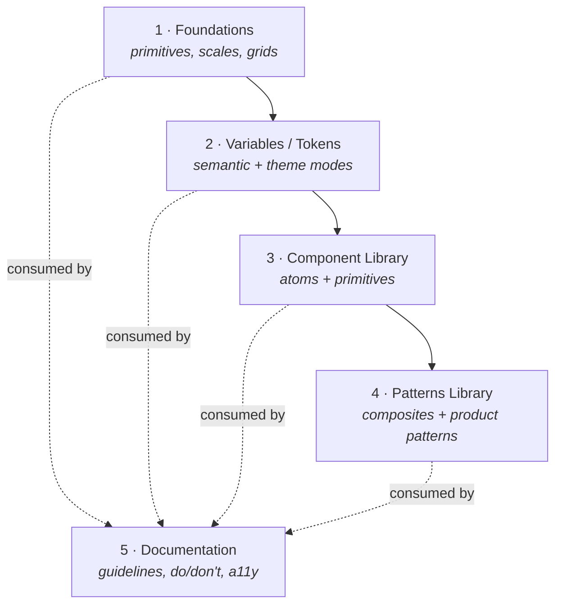
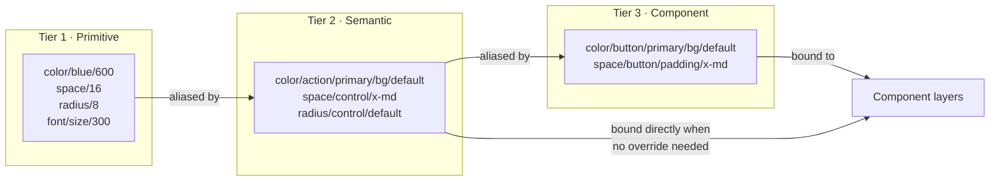
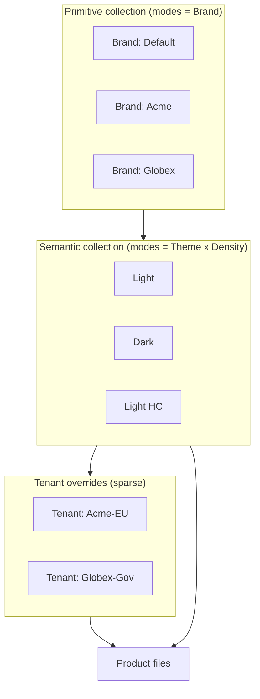
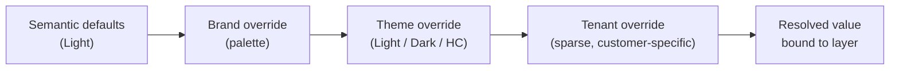
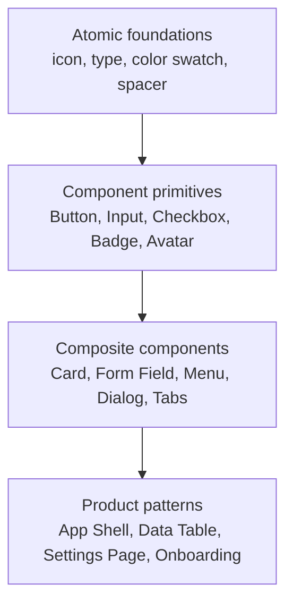
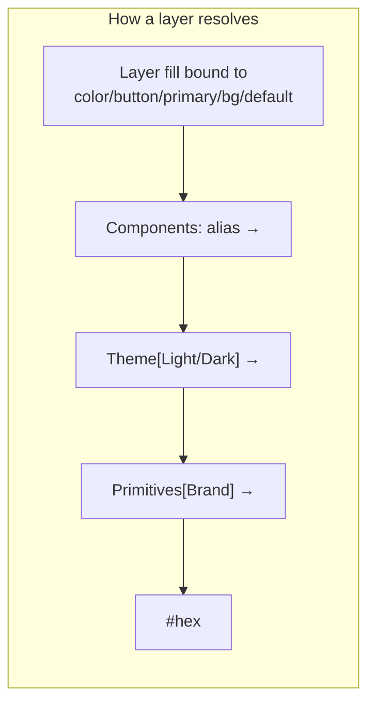
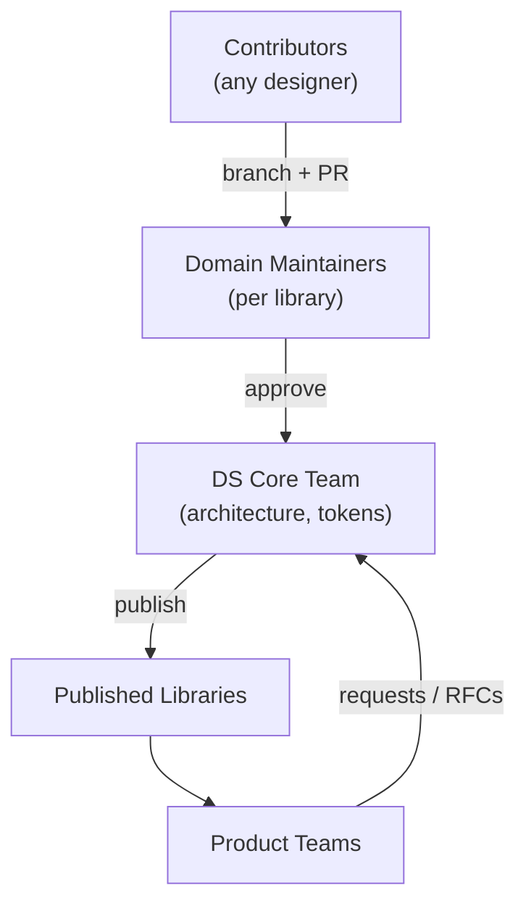
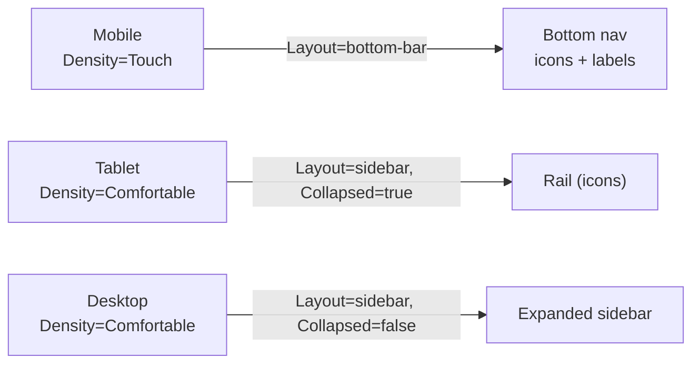
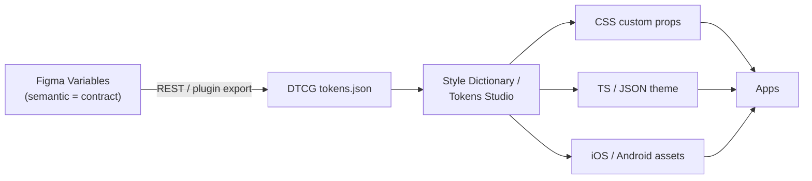

# Enterprise Figma Design System Architecture

> A scalable, white-label, multi-product design system blueprint built on modern Figma **Variables** and **Component Properties**. Deprecated Styles are avoided except where Figma still requires them (text styles, complex multi-layer effects).

This document extends the conventions already established in [`token-map.md`](./token-map.md):
- `/` separates hierarchy levels (`color/action/primary/bg/default`).
- `-` joins words inside a single segment (`on-primary`, `body-sm`).
- Three tiers: **Primitive → Semantic → Component**.

---

## 0. Design Goals

| Goal | How the architecture delivers it |
| --- | --- |
| Multi-product ecosystem | Shared foundation + per-product pattern libraries that consume the same semantic tokens |
| White-label branding | Brand + Tenant variable modes layered on a fixed semantic API |
| Light & dark themes | `Theme` collection modes; components never reference primitives directly |
| WCAG 2.2 AA | Contrast-validated semantic pairs, focus tokens, target-size spacing tokens |
| Responsive web + mobile | `Density`/`Breakpoint` modes + responsive spacing scale |
| Design-to-code sync | DTCG-compatible token export; semantic layer is the stable contract |
| Many teams in parallel | Library-per-domain split, branching, codeowners-style governance |

---

## 1. File Structure

The system is split into **five published libraries**. Splitting by responsibility (not by product) keeps publish blast-radius small and lets teams work without lock contention.



| # | Library | Owns | Publishes to | Change cadence |
| --- | --- | --- | --- | --- |
| 1 | **Foundations** | Primitive variables, raw scales, grid definitions, iconography source | Variables | Rare (quarterly) |
| 2 | **Variables / Tokens** | Semantic + component variable collections, all theme/mode definitions | Components, Patterns | Controlled (per release) |
| 3 | **Component Library** | Atomic + primitive components with Component Properties | Patterns, Products | Weekly |
| 4 | **Patterns Library** | Composite components, product-specific assemblies | Product files | Weekly |
| 5 | **Documentation** | Usage guidance, a11y specs, governance, changelog | (read-only) | Continuous |

**Dependency rule:** dependencies flow in one direction only (Foundations → Variables → Components → Patterns → Products). A lower layer must never reference an upper layer.

---

## 2. Variable Architecture — 3-Tier Model



### Tier responsibilities

| Tier | Describes | Themeable? | Bound to layers directly? | Example |
| --- | --- | --- | --- | --- |
| **Primitive** | Raw value, no meaning | Only via mode (e.g. raw palette per brand) | ❌ Never | `color/blue/600 = #2563EB` |
| **Semantic** | Purpose / usage | ✅ Yes — this is where theming happens | ✅ Default choice | `color/action/primary/bg/default → {color/blue/600}` |
| **Component** | Component-specific decision | Inherits from semantic | ✅ Only for component-unique needs | `color/button/primary/bg/default → {color/action/primary/bg/default}` |

**Core principle (from `token-map.md`):** prefer binding semantic tokens directly. Only introduce a **component** token when the component has a genuinely unique value or state that should not move with the global semantic token. Do not tokenize one-off values — flag them `Needs Review`.

### Resolution example (a primary button background in dark mode, Tenant-Acme)

```
component:  color/button/primary/bg/default
   ↓ alias
semantic:   color/action/primary/bg/default        [Theme=Dark]
   ↓ alias
primitive:  color/brand/primary/600                 [Brand=Acme]
   ↓ value
raw:        #4F86F7
```

The component layer is bound once. Switching theme or brand mode re-resolves the whole chain with no edits to the component.

---

## 3. Token Naming Conventions

General grammar:

```
<category>/<role|group>/<element>/<property>/<variant|state>
```

Use lowercase, `/` for hierarchy, `-` inside a segment. Scales use numeric steps (`100…900`) for primitives and t-shirt sizes (`xs…2xl`) for semantic spacing.

### 3.1 Colors

| Layer | Pattern | Examples |
| --- | --- | --- |
| Primitive | `color/<hue>/<step>` | `color/blue/600`, `color/gray/900`, `color/white` |
| Brand primitive | `color/brand/<role>/<step>` | `color/brand/primary/600`, `color/brand/accent/400` |
| Semantic — surface | `color/bg/<role>` | `color/bg/default`, `color/bg/subtle`, `color/bg/elevated`, `color/bg/inverse` |
| Semantic — text | `color/text/<role>` | `color/text/default`, `color/text/subtle`, `color/text/on-primary` |
| Semantic — border | `color/border/<role>` | `color/border/default`, `color/border/focus`, `color/border/error` |
| Semantic — action | `color/action/<intent>/<part>/<state>` | `color/action/primary/bg/hover`, `color/action/danger/text/default` |
| Semantic — feedback | `color/feedback/<status>/<part>` | `color/feedback/success/bg`, `color/feedback/warning/text` |
| Component | `color/<component>/<intent>/<part>/<state>` | `color/button/primary/bg/pressed` |

Intents: `primary`, `secondary`, `tertiary`, `danger`, `success`, `warning`, `info`, `neutral`.
States: `default`, `hover`, `pressed`, `focus`, `disabled`, `selected`, `visited`.
Parts: `bg`, `text`, `border`, `icon`, `ring`.

### 3.2 Typography

Avoid deprecated text Styles where the workflow allows, but Figma still binds font properties through **Text Styles**; back each Text Style with **typography variables** so the source of truth stays in tokens.

| Token | Pattern | Examples |
| --- | --- | --- |
| Family | `font/family/<role>` | `font/family/sans`, `font/family/mono` |
| Size | `font/size/<scale>` | `font/size/body-sm`, `font/size/heading-lg` |
| Weight | `font/weight/<name>` | `font/weight/regular`, `font/weight/semibold` |
| Line height | `font/line-height/<scale>` | `font/line-height/body-sm` |
| Letter spacing | `font/tracking/<scale>` | `font/tracking/heading-lg` |

Composite Text Styles named by role: `Heading/LG`, `Body/MD`, `Label/SM`, `Code/MD` — each bound to the variables above.

### 3.3 Spacing

| Layer | Pattern | Examples |
| --- | --- | --- |
| Primitive (4px base) | `space/<px>` | `space/4`, `space/8`, `space/16`, `space/24` |
| Semantic | `space/<context>/<size>` | `space/control/x-md`, `space/layout/section`, `space/stack/sm` |
| Component | `space/<component>/<part>/<size>` | `space/button/padding/x-md`, `space/card/gap` |

Sizes: `2xs, xs, sm, md, lg, xl, 2xl`. Contexts: `control` (inside interactive elements), `stack` (vertical rhythm), `inline` (horizontal gaps), `layout` (page-level).

### 3.4 Radius

| Layer | Pattern | Examples |
| --- | --- | --- |
| Primitive | `radius/<px or name>` | `radius/0`, `radius/4`, `radius/8`, `radius/full` |
| Semantic | `radius/<context>/<size>` | `radius/control/default`, `radius/surface/lg`, `radius/pill` |
| Component | `radius/<component>` | `radius/button`, `radius/card` |

### 3.5 Elevation

Elevation is delivered through **effect variables** (Figma now supports variable-bound shadows). Pair each elevation with a surface color so light/dark render correctly.

| Layer | Pattern | Examples |
| --- | --- | --- |
| Primitive | `shadow/<step>` | `shadow/100`, `shadow/200`, `shadow/400` |
| Semantic | `elevation/<role>` | `elevation/raised`, `elevation/overlay`, `elevation/modal` |
| Z-index (number var) | `z/<role>` | `z/dropdown`, `z/modal`, `z/toast` |

### 3.6 Motion

| Layer | Pattern | Examples |
| --- | --- | --- |
| Duration (number, ms) | `motion/duration/<speed>` | `motion/duration/fast`, `motion/duration/base`, `motion/duration/slow` |
| Easing (string) | `motion/easing/<curve>` | `motion/easing/standard`, `motion/easing/emphasized`, `motion/easing/exit` |
| Semantic | `motion/<interaction>` | `motion/hover`, `motion/expand`, `motion/page-transition` |

> Motion values live as variables so they export to code even though Figma prototyping doesn't bind them yet — they are the design-to-code contract for engineers.

---

## 4. White-Label Strategy

The white-label system layers **two independent axes** on top of a **stable semantic API**. Products and components only ever reference the semantic layer, so rebranding never touches a component.



### 4.1 Brand themes
A **brand** redefines the *primitive brand palette* (`color/brand/*`) and optionally the type family. Implemented as **modes in the Primitive collection** (`Brand: Default | Acme | Globex`). Semantic tokens alias `color/brand/*`, so swapping the brand mode recolors the entire system.

### 4.2 Tenant themes
A **tenant** is a customer-specific variation *of a brand* (e.g. `Acme-EU`, `Acme-Gov`). Tenants are **sparse override modes** — they only redefine the handful of semantic tokens that differ (e.g. a different `color/action/primary/bg/default`), inheriting everything else.

### 4.3 Theme inheritance



Inheritance order (later wins): **Semantic default → Brand palette → Theme mode → Tenant override**. Any level a tenant doesn't specify falls through to the brand/theme value.

### 4.4 Theme overrides
- Overrides are **always at the semantic tier** — never on primitives or components.
- A tenant override file holds only the *delta* tokens, keeping reviews tiny and auditable.
- Validation gate: every override must still pass the **WCAG 2.2 AA contrast check** against its paired surface/text token before publish.

---

## 5. Component Architecture



| Layer | Definition | Lives in | Component Properties used |
| --- | --- | --- | --- |
| **Atomic foundations** | Indivisible primitives, tokens made visible | Foundations / Components | minimal |
| **Component primitives** | Single-responsibility interactive elements | Component Library | Variant, Boolean, Instance-swap, Text |
| **Composite components** | Assemblies of primitives | Patterns Library (or Components) | Nested instance properties, exposed props |
| **Product patterns** | Page/flow-level assemblies | Patterns Library / Product | Slots via instance-swap |

**Rules**
- Every component is built with **Auto Layout** and bound to **semantic/component variables** (no hardcoded values — per `qa-checklist.md`).
- States (`hover`, `focus`, `pressed`, `disabled`) are **Variant** properties, not separate components.
- Prefer **Component Properties** (Boolean/Text/Instance-swap) over variant explosion. Use variants for *visual style/state*; use props for *content/config*.
- Expose nested properties so consumers configure a composite without detaching.

---

## 6. Folder Organization

Within each library, folders mirror the architecture. `_` prefix sorts internal/private items to the top.

```
Component Library (file)
├─ 📄 Cover
├─ 📄 _Sandbox            (WIP, not published)
├─ 📄 _Templates          (slot/boilerplate frames)
├─ 📄 Foundations         (published atoms)
│  ├─ Icon
│  └─ Typography specimens
├─ 📄 Primitives
│  ├─ Button
│  ├─ Input
│  ├─ Checkbox / Radio / Switch
│  └─ Badge / Avatar / Tag
└─ 📄 Composites
   ├─ Card
   ├─ Form Field
   ├─ Menu / Dropdown
   └─ Dialog / Sheet
```

Component naming inside the file uses `/` to create the asset-panel tree:
`Button/Primary`, `Button/Secondary`, `Card/Elevated`, `Input/Text`.

---

## 7. Recommended Figma Pages

Per-library page layout (consistent across the five files):

| Page | Purpose |
| --- | --- |
| `📌 Cover` | File identity, version, owner, status |
| `📖 Read Me / Changelog` | How to use, what changed, branch policy |
| `🎨 Foundations` | Tokens visualized (color, type, space, elevation) |
| `🧩 Components` | The published components (one section per component) |
| `🔬 Specs` | Anatomy, measurements, do/don't, a11y notes |
| `🧪 Playground` | Live examples, theme/brand switch demos |
| `🗄️ Archive` | Deprecated items kept for reference (not published) |
| `🚧 WIP` | Drafts excluded from publish |

---

## 8. Variable Collections and Modes

Use **separate collections** so each axis of variation has its own mode set. A layer can resolve through multiple collections simultaneously, which is how Brand × Theme × Density compose.

| Collection | Tier | Modes (axis) | Why separate |
| --- | --- | --- | --- |
| `Primitives` | Primitive | `Brand: Default · Acme · Globex` | Brand = palette swap |
| `Theme` (semantic color) | Semantic | `Light · Dark · Light-HC · Dark-HC` | Theme = light/dark/high-contrast |
| `Density` (semantic space/size) | Semantic | `Comfortable · Compact · Touch` | Mobile/desktop density |
| `Tenant` | Override | `None · Acme-EU · Globex-Gov · …` | Sparse customer deltas |
| `Components` | Component | (no modes — aliases only) | Inherit from semantic |
| `Motion` | Cross-cutting | (no modes) | Shared timings |



**Mode selection in practice:** a product mobile screen in dark mode for Acme sets `Primitives=Acme`, `Theme=Dark`, `Density=Touch`, `Tenant=None` on the page frame. Every nested component inherits and resolves automatically.

---

## 9. Governance Model for Enterprise Teams



### Roles
| Role | Owns | Rights |
| --- | --- | --- |
| **DS Core team** | Foundations + Variables, naming, architecture | Publish tokens, approve breaking changes |
| **Library maintainers** | One component/pattern domain each | Review + publish in their domain |
| **Contributors** | Feature work | Open branches + PRs, propose tokens |
| **Consumers (product teams)** | Product files | Consume; submit RFCs |

### Workflow
1. **Branch** the relevant library (Figma branching) — never edit `main` directly.
2. Build/change against **semantic tokens**; new tokens go to a `Needs Review` section, not straight into the system.
3. Open a **review request**; maintainer + (for tokens) Core review.
4. Run the **publish checklist** (below), then merge & publish with a **semver-style changelog** entry.
5. Consumers update library to the new version on their cadence.

### Token change policy (semver)
- **Patch** — value tweak within AA contrast (e.g. hover shade). No API change.
- **Minor** — new token added, nothing removed.
- **Major** — rename/remove/retarget a semantic token → requires migration note + deprecation window (token kept + flagged `deprecated` per `token-map.md`).

### Publish checklist (gates, aligned with `qa-checklist.md`)
- [ ] No hardcoded values; all bound to variables.
- [ ] Light, Dark, and HC modes resolve correctly.
- [ ] WCAG 2.2 AA contrast verified for new/changed color pairs.
- [ ] Naming follows convention; new tokens reviewed by Core.
- [ ] Changelog + `migration-log.md` entry added.

### Accessibility governance (WCAG 2.2 AA)
- Text contrast ≥ **4.5:1** (≥ **3:1** for large text / UI components & graphics).
- `color/border/focus` provides a visible focus indicator (≥ 3:1 vs adjacent, **2.4.11/2.4.13**).
- Interactive targets ≥ **24×24px** (**2.5.8**) — enforced via `space/control/*` minimums.
- Never encode state by color alone — pair with icon/text (Variant + Boolean prop).

---

## 10. Example Implementations

Each example shows: **Component Properties**, **variable bindings**, and the **DTCG token export** that keeps design and code in sync. Token JSON uses the W3C Design Tokens format (`$type`/`$value`, `{alias}` references).

### 10.1 Button

**Component Properties**
| Property | Type | Values |
| --- | --- | --- |
| `Intent` | Variant | `primary · secondary · danger · ghost` |
| `Size` | Variant | `sm · md · lg` |
| `State` | Variant | `default · hover · pressed · focus · disabled` |
| `Label` | Text | "Button" |
| `Leading icon` | Boolean | true/false |
| `Trailing icon` | Boolean | true/false |
| `Icon` | Instance swap | Icon set |

**Variable bindings (Intent=primary, Size=md)**
| Layer property | Variable |
| --- | --- |
| Fill | `color/button/primary/bg/{state}` |
| Label color | `color/button/primary/text/default` → `color/text/on-primary` |
| Corner radius | `radius/button` → `radius/control/default` |
| Padding X | `space/button/padding/x-md` → `space/control/x-md` |
| Padding Y | `space/button/padding/y-md` |
| Min height | `space/control/target-min` (≥24px, WCAG 2.5.8) |
| Focus ring | `color/border/focus` |

```json
{
  "color": {
    "button": {
      "primary": {
        "bg": {
          "default": { "$type": "color", "$value": "{color.action.primary.bg.default}" },
          "hover":   { "$type": "color", "$value": "{color.action.primary.bg.hover}" },
          "pressed": { "$type": "color", "$value": "{color.action.primary.bg.pressed}" },
          "disabled":{ "$type": "color", "$value": "{color.action.primary.bg.disabled}" }
        },
        "text": {
          "default": { "$type": "color", "$value": "{color.text.on-primary}" }
        }
      }
    }
  },
  "radius": { "button": { "$type": "dimension", "$value": "{radius.control.default}" } },
  "space":  { "button": { "padding": {
    "x-md": { "$type": "dimension", "$value": "{space.control.x-md}" },
    "y-md": { "$type": "dimension", "$value": "{space.control.y-md}" }
  } } }
}
```

### 10.2 Card

**Component Properties**
| Property | Type | Values |
| --- | --- | --- |
| `Variant` | Variant | `flat · elevated · outlined` |
| `Media` | Boolean | true/false |
| `Header slot` | Instance swap | content slot |
| `Body slot` | Instance swap | content slot |
| `Footer` | Boolean | true/false |
| `Footer actions` | Instance swap | Button group |

**Variable bindings**
| Layer property | Variable |
| --- | --- |
| Surface fill | `color/bg/elevated` (elevated) / `color/bg/default` (flat) |
| Border | `color/border/subtle` (outlined only) |
| Corner radius | `radius/card` → `radius/surface/lg` |
| Padding | `space/card/padding` → `space/layout/md` |
| Internal gap | `space/card/gap` → `space/stack/sm` |
| Shadow | `elevation/raised` (elevated variant) |

```json
{
  "color": { "card": {
    "bg":     { "$type": "color", "$value": "{color.bg.elevated}" },
    "border": { "$type": "color", "$value": "{color.border.subtle}" }
  } },
  "radius": { "card": { "$type": "dimension", "$value": "{radius.surface.lg}" } },
  "space":  { "card": {
    "padding": { "$type": "dimension", "$value": "{space.layout.md}" },
    "gap":     { "$type": "dimension", "$value": "{space.stack.sm}" }
  } },
  "shadow": { "card": { "$type": "shadow", "$value": "{elevation.raised}" } }
}
```

### 10.3 Input

**Component Properties**
| Property | Type | Values |
| --- | --- | --- |
| `State` | Variant | `default · focus · error · disabled · read-only` |
| `Size` | Variant | `sm · md · lg` |
| `Label` | Text | "Label" |
| `Show label` | Boolean | true/false |
| `Show helper` | Boolean | true/false |
| `Helper text` | Text | "Helper" |
| `Leading icon` | Boolean + Instance swap | — |

**Variable bindings**
| Layer property | Variable |
| --- | --- |
| Field fill | `color/input/bg/default` → `color/bg/default` |
| Border (default) | `color/border/default` |
| Border (focus) | `color/border/focus` |
| Border (error) | `color/border/error` |
| Text | `color/text/default` |
| Placeholder | `color/text/subtle` |
| Helper (error) | `color/feedback/error/text` |
| Radius | `radius/control/default` |
| Padding X / Y | `space/control/x-md` / `space/control/y-md` |
| Min height | `space/control/target-min` (≥24px) |

```json
{
  "color": { "input": {
    "bg":          { "$type": "color", "$value": "{color.bg.default}" },
    "border": {
      "default":   { "$type": "color", "$value": "{color.border.default}" },
      "focus":     { "$type": "color", "$value": "{color.border.focus}" },
      "error":     { "$type": "color", "$value": "{color.border.error}" }
    },
    "text":        { "$type": "color", "$value": "{color.text.default}" },
    "placeholder": { "$type": "color", "$value": "{color.text.subtle}" }
  } },
  "radius": { "input": { "$type": "dimension", "$value": "{radius.control.default}" } }
}
```

> Accessibility: `error` state must also expose an icon + helper text (never color alone), and the field's `aria-describedby` maps to the helper slot in code.

### 10.4 Navigation

Two responsive expressions of one component family, switched via **Density / Breakpoint** modes and a `Layout` variant.

**Component Properties (App Nav)**
| Property | Type | Values |
| --- | --- | --- |
| `Layout` | Variant | `sidebar · topbar · bottom-bar` |
| `Collapsed` | Boolean | true/false (sidebar) |
| `Items` | Instance swap (slot) | Nav Item list |
| `Brand slot` | Instance swap | Logo |

**Nav Item properties**
| Property | Type | Values |
| --- | --- | --- |
| `State` | Variant | `default · hover · selected · disabled` |
| `Icon` | Boolean + Instance swap | — |
| `Label` | Text | "Item" |
| `Badge` | Boolean | true/false |

**Variable bindings (Nav Item)**
| Layer property | Variable |
| --- | --- |
| Bg (selected) | `color/nav/item/bg/selected` → `color/action/primary/bg/subtle` |
| Bg (hover) | `color/nav/item/bg/hover` → `color/bg/subtle` |
| Text (selected) | `color/nav/item/text/selected` → `color/action/primary/text/default` |
| Text (default) | `color/text/subtle` |
| Indicator | `color/border/focus` (focus) / `color/action/primary/bg/default` (selected rail) |
| Item height | `space/control/target-min` |
| Item gap | `space/stack/2xs` |

```json
{
  "color": { "nav": { "item": {
    "bg": {
      "hover":    { "$type": "color", "$value": "{color.bg.subtle}" },
      "selected": { "$type": "color", "$value": "{color.action.primary.bg.subtle}" }
    },
    "text": {
      "default":  { "$type": "color", "$value": "{color.text.subtle}" },
      "selected": { "$type": "color", "$value": "{color.action.primary.text.default}" }
    }
  } } }
}
```

**Responsive behavior**


---

## Appendix A — Design-to-Code Sync Pipeline



- The **semantic layer is the API**; primitives and component tokens are implementation detail.
- Export per mode → one theme file per `Brand × Theme` combination.
- CI diff on `tokens.json` blocks merges that change a token without a changelog entry (ties into the governance semver policy).

## Appendix B — Quick conventions cheatsheet

| Do | Don't |
| --- | --- |
| `color/action/primary/bg/hover` | `primaryBlue`, `buttonBlue` |
| `space/control/x-md` | `space-control-x-md`, `gap1` |
| Bind semantic tokens directly | Bind primitives to layers |
| Add component token only when unique | Tokenize every one-off value |
| Variants for state, props for content | Variant explosion for everything |
| Theme at semantic tier | Override primitives per tenant |
